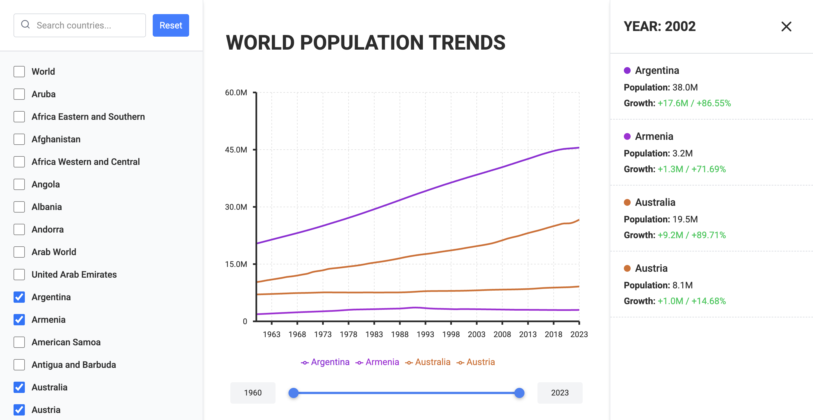

# Population Dashboard

An interactive dashboard for visualizing global population trends. Built with React (frontend) and Python FastAPI (backend).

## Setup

For installation and usage instructions, see the respective `README.md` files in the backend and frontend directories:

- [Backend README](backend/README.md)
- [Frontend README](frontend/README.md)

